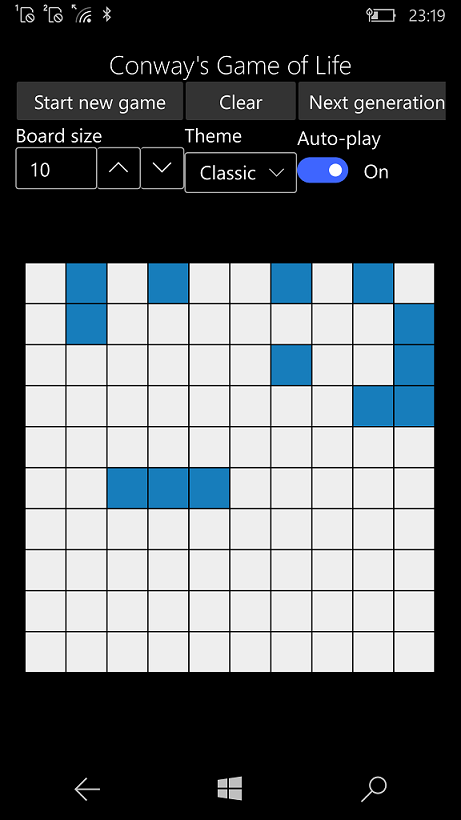

# Conway's Game of Life in Uno Platform

This is my fork of https://github.com/MartinZikmund/Uno.ConwaysGameOfLife

The goal: Win10Mobile "assembly" :)

## About the original

The Game of Life is an interesting yet simulation of the evolution of living cells, that was devised by British mathematician John Conway in 1970. This is an implementation of thiz zero-player game in Uno Platform, targeting Windows (10, 7), Android, iOS, macOS, WebAssembly, Linux GTK and Tizen.

## Screenshots

## Status

- Target W10/W11 UWP: all of my experiments passed;
- Target W10M: ready (v1.0 released)

## Article ( Best Multi-platform How-To / DIY ))

https://blog.mzikmund.com/2020/12/game-of-life-in-uno-platform/

## License

Licensed under MIT, feel free to fork, modify and play with the project however you like! 

## .
AS IS. No support. RnD only.

[m][e] 2022
